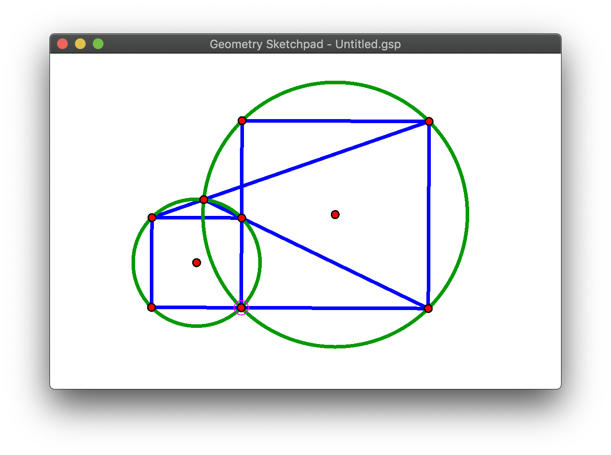

# Geometry Sketchpad

A Cross-Platform Sketchpad written in Rust using [specs](https://slide-rs.github.io/specs/)



(P.S. The screen shot is from [IMO 1959 Problem 5](https://artofproblemsolving.com/wiki/index.php/1959_IMO_Problems/Problem_5))

## How to build/run

Type

```
$ cargo run --bin geopad-foundation --release
```

If you are using a Windows machine, you can do

```
$ cargo run --bin geopad-win --release
```

We also have an [Electron](https://github.com/electron/electron) port. You can type

```
$ cd app/electron
$ npm install
$ npm run build
$ npm start
```

to run the electron app.

## How to use

See [interaction scheme](doc/interaction_scheme.md).

## Code Structure

`core` folder stores the core libraries of Geometry Sketchpad. `core-lib` includes only the bare minimal of the systems, components, resources, auxilliary data structures, and events to get the system working. `core-ui` wraps around `core-lib` and provide all UI abstraction for the user to interact with the system.

`app` folder includes the executable applications. Currently we have three applications:

- `geopad-foundation`: `/app/foundation`. This one is using [PistonWindow](https://github.com/PistonDevelopers/piston_window) for a cross platform experience. It has `window_system` which does all the window event handling and rendering. It will pass the window events to `core-ui`'s abstracted events. And it will also read from system data to do the rendering
- `geopad-win`: `/app/win`. This application is intended to only runnable on Windows platform. It uses native windows API to provide a native experience.
- `geopad-electron`: `/app/electron`. This is a port of geopad in Electron platform. (As a side note, this also demonstrates its ability to be ran on web platforms.) It is using [Neon](https://neon-bindings.com) as the binding layer, [Electron](https://github.com/electron/electron) as window driver, [PIXI](https://www.pixijs.com) as WebGL renderer. It is, of course, using `core-ui` as geopad backend.