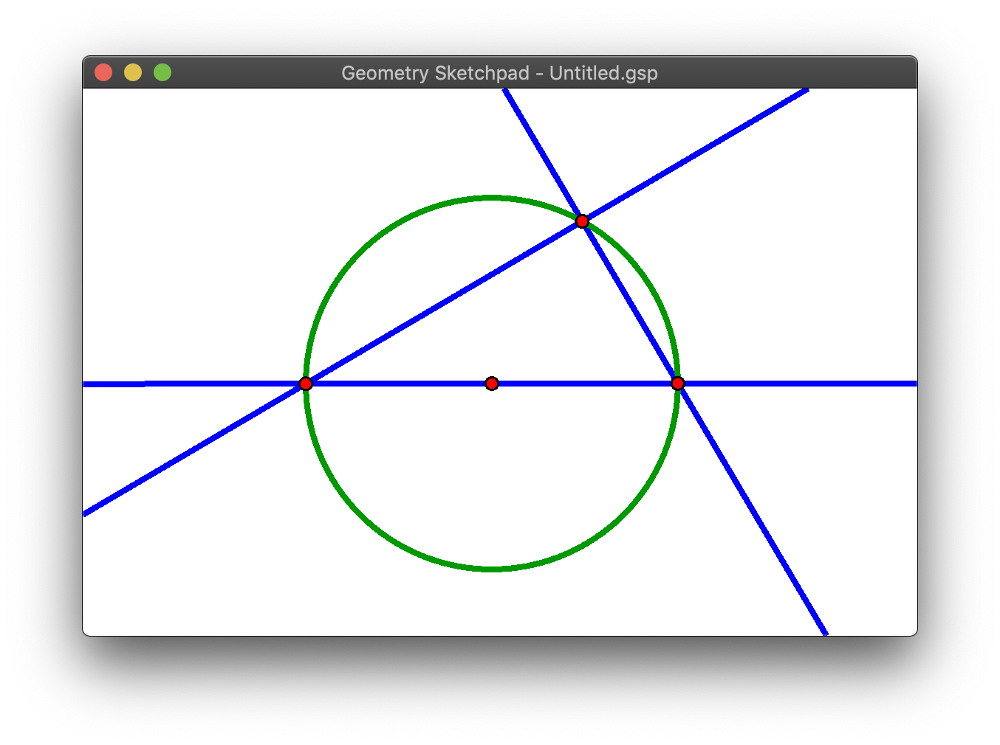

# Geometry Sketchpad

A Cross-Platform Sketchpad written in Rust using [Piston](https://www.piston.rs) and [specs](https://slide-rs.github.io/specs/)



## How to build/run

Simply

```
$ cargo run
```

to run the application. If you want to enable the optimizations, do

```
$ cargo run --release
```

## How to use

See [interaction scheme](doc/interaction_scheme.md).

## Code structures

Since we use an entity component system, we clearly divide the whole projects to `component`s, `resource`s and `system`s.
`component`s are the lines, points in our app, and `resource` will be the event systems and global states of the app.
`system` takes charge of operating everything.

In `system`s, we divide the system into several categories:

- Interaction system: read user input and emit events
- Cache managers: read events and keep the data structures updated. The data structures are used to accelerate the interactions;
- State managers: will operate on global states like viewport, tools and exits.
- Geometry actions: the intermediate event dispatcher that reads high level user command and transform them into low level operations;
- Geometry systems: the systems that actually deal with all the internal points, lines, and solve for the final shape;
- Geometry renderers: the systems that will create intermediate shapes for render.

Some other files to look at

- [window_system.rs](src/systems/window_system.rs) will deal with a piston window and do all the input event dispatching and rendering.
- [main.rs](src/main.rs) will create a main window and initialize all the systems